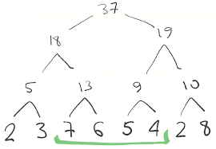

## Дерево отрезков

Дерево отрезков (Segment Tree) — это структура данных, которая позволяет эффективно выполнять операции на отрезках массива. Основные операции, которые поддерживает дерево отрезков:

1. Обновление элемента массива за O(log n)
2. Вычисление функции (сумма, минимум, максимум и т.д.) на отрезке за O(log n)

Казалось бы, зачем нам ДО, когда мы можем более узкие функции, например, префиксные суммы . ДО - очень гибкая структура данных, которая поможет вам делать все эти операции вполне быстро.

RMQ - задача поиска минимума на отрезках

RSQ - задача поиска суммы на отрезках

### Структура дерева отрезков

Дерево отрезков представляет собой бинарное дерево, где:
- Корень дерева соответствует всему массиву [0, n-1]
- Каждый узел соответствует некоторому отрезку [l, r]
- Листья дерева соответствуют отдельным элементам массива.
- Каждый внутренний узел имеет двух потомков: левый соответствует отрезку [l, mid], правый — отрезку [mid+1, r], где mid = (l + r) / 2

### Построение дерева отрезков

Построение дерева отрезков выполняется рекурсивно:

```cpp
// Массив для хранения дерева отрезков
int tree[4*MAXN];

// Функция построения дерева
void build(int a[], int v, int tl, int tr) {
    if (tl == tr) {
        tree[v] = a[tl];
    } else {
        int tm = (tl + tr) / 2;
        build(a, v*2, tl, tm);
        build(a, v*2+1, tm+1, tr);
        tree[v] = tree[v*2] + tree[v*2+1]; // Для суммы на отрезке
    }
}
```
Именно данная функция вам поможет, как она устроена. Наше дерево занимает O(n) памяти.

### Пример ДО на суммы:



### Запрос на отрезке 
```cpp
// Функция запроса суммы на отрезке [l, r]
int sum(int v, int tl, int tr, int l, int r) {
    if (l > r) 
        return 0;
    if (l == tl && r == tr) {
        return tree[v];
    }
    int tm = (tl + tr) / 2;
    return sum(v*2, tl, tm, l, min(r, tm))
         + sum(v*2+1, tm+1, tr, max(l, tm+1), r);
}
```
Мне эта реализация не нравится, потом перепишу.

### Обновление элемента 

```cpp
// Функция обновления элемента
void update(int v, int tl, int tr, int pos, int new_val) {
    if (tl == tr) {
        tree[v] = new_val;
    } else {
        int tm = (tl + tr) / 2;
        if (pos <= tm)
            update(v*2, tl, tm, pos, new_val);
        else
            update(v*2+1, tm+1, tr, pos, new_val);
        tree[v] = tree[v*2] + tree[v*2+1];
    }
}
```

 ### Фанфакты про дерева отрезков

 1. Любой отрезок по l,r можно разбить на 2*log n вершин.
    - Доказательство аналогично пункту 2.

 2. Функция get делает не более 4*log n рекурсивных вызовов
    - Докажем по индукции по уровням отрезков. Корень очевидно. Давайте докажем, что на каждом слое мы делаем не больше 4 уровней. 
    
    - База очевидна. В корне 1 вызов. 
    
    - ИП: На текущем уровне есть 4 вершины и докажем, что из них вызовется не более 4 вершин. Посмотрим на границы(потому что вершины слева и справа от наших границ не запустятся и то, что между ними тоже не запустится). Я могу запуститься вниз максимум только от 2 из них. Откуда и правда побеждаем. (В данном случае мы "запускаем" максимум 4 снизу) 

Итого вот такая вкусная структура данных.

