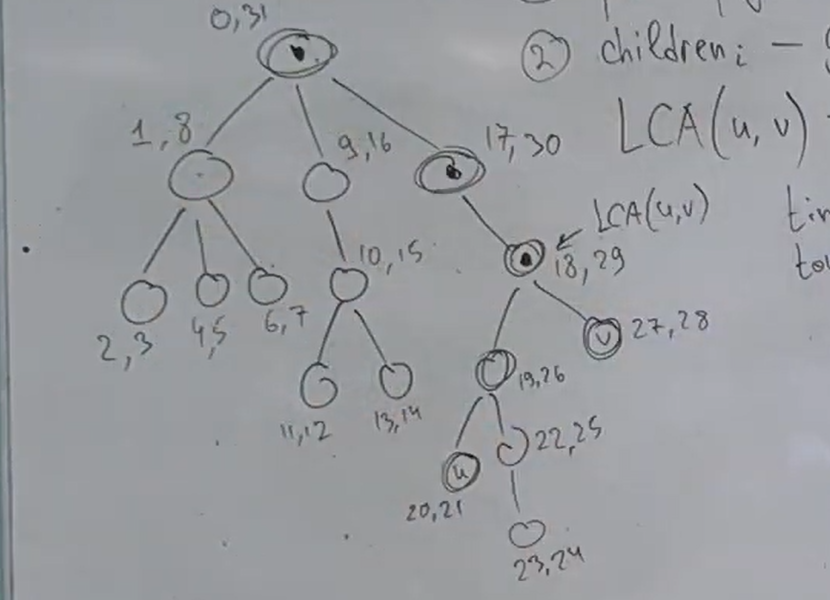
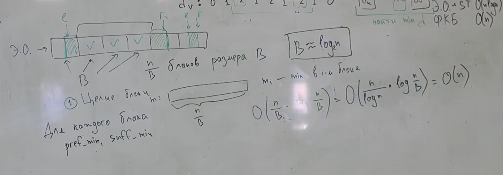
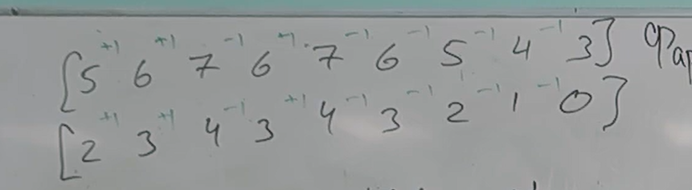

# Деревья.

Деревья храним 2-умя образами:

- Храним родителей.
- Храним детей.

## LCA

LCA(u,v) - Lowest Common Ancestor - это узел w, который является предком и u, и v, и находится на максимальной глубине в дереве. Другими словами, w находится ближе всего к u и v среди всех общих предков.

### Более простая задача.

Давайте решим сначала более простую задачу. Я хочу понимать является ли u предком v. 

У этого есть очевидное тупое решение, но мы люди не тупые => пишем умное. 

Для этого запустим dfs из корня и для каждой вершины будем хранить время входа в вершину и время выхода.



Ура, мы теперь умеем решать задачу LCA за линию. Будем поднимать одну вершину наверх, пока не выполнится описанное выше условие.

## Двоичные подъемы.

 Двоичное поднятие (подъемы) (Binary Lifting) (O(log n) времени на запрос):

 Концептуально мы берем прошлую идею и накручиваем на нее бин. поиск по тому, на сколько мы должны подняться
-   Предварительно вычисляется таблица `up[i][node]`, где up[i][node] — предок узла node на расстоянии 2<sup>i</sup>. Как такое считать?
    - `up[0][v] = pv`
    - `up[k][v] = up[k-1][up[k-1][v]]`
 -   Во время запроса LCA используются двоичные представления расстояний, чтобы быстро "поднимать" узлы.
 -   Общая идея та же, что и в подходе с уровнями, но с более быстрыми операциями подъема.  Этот метод отлично подходит для множества запросов LCA.

```cpp
// n - высота дерева
for k = log n...0:, n
    pu = up[k][u]
    if(!isParent(pu, v)):
        u = pu
```
|   Препроцессинг | Запрос|
|:----:|:----:|
| O(n log n) | O(log n) |

## Эйлеров обход

Пронумеруем вершины. Запустим dfs. Каждый раз, когда мы заходим в вершину, выписываем ее номер. У каждой вершины посчитаю редом глубину.

Общая идея:
1.  Для узлов u и v, найти их индексы первого вхождения в последовательности Эйлерова обхода (first[u] и first[v]).
2.  Найти узел с минимальным уровнем в диапазоне `[first[u], first[v]]` (или `[first[v], first[u]]`, если first[v] < first[u]) в массиве уровней.  Этот узел является LCA(u, v).

Это следует из пары фактом про этот отрезкок.
1. На отрезке есть LCA.
2. У LCA min глубина.
3. Нет других вершин с min глубиной.

Надо научиться считать минимум на отрезке. Например с помощью ДО.

Итого:

|   Препроцессинг | Запрос|
|:----:|:----:|
| O(n) | O(log n) |

## Sparse Table.

`st[k][i] = min на [i, i + 2^i)`
 
Оно будет считаться примерно так:

`st[k][i] = min(st[k-1][i], st[k-1][i + 2^(k-1)])`

Итого, искав так минус мы для LCA получаем вот такой результат:

|   Препроцессинг | Запрос|
|:----:|:----:|
| O(n log n) | O(1) |

## Алгоритм Фарах-Колтон и Бендор

Разобьем на блоки размера B. Ищем минимум на целых блоках. и на краешках.

Для каждого блока считаем префиксные и суффиксные минимумы.



Дальше идет грязь. Каждый блок у нас выглядит как массив из +-1, например так:



И теперь предподсчитаем все такие массивы из +-1. 
Это будет работать за 2^B B^3. Можно сделать O(n).

Все это один большой кеш мисс.
