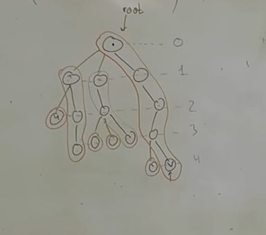

# LA (Level Ancestor)

Есть дерево.  Есть запросы LA(v,k) - предок v на уровне k. Уровни индексируются снизу вверх

Первое очевидное решение это двоичные подъемы.

|   Препроцессинг | Запрос|
|:----:|:----:|
| O(n log n) | O(log n) |

## Long-Path Decompostion

Возьму неиспользованную верхнюю вершину. Возьму в ее поддереве самый глубокий лист, выделю путь от листа до выбранной вершины, помечу все вершины на пути неиспользованными и продолжу алгоритм

Пример:

|   Препроцессинг | Запрос|
|:----:|:----:|
| O(n) | O(sqrt n) |

## Ladder Decompostion

Возьмем LPD, но увеличим высоту пути в 2 раза. Тадам

|   Препроцессинг | Запрос|
|:----:|:----:|
| O(n) | O(log n) |

## Ladder +  Двоичные

Тут все очевидно

|   Препроцессинг | Запрос|
|:----:|:----:|
| O(n log n) | O(1) |

## HLD

То же самое, что и Long -Path, только теперь по весу вершины (количеству вершин в поддереве).