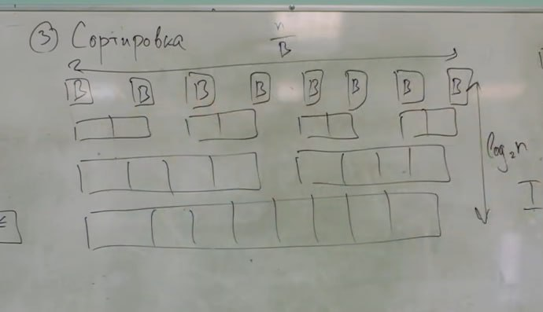

# Внешняя память

Мотивация: Мы жили в RAM - модели, которая считает и обращается к данным за O(1). Но по жизни скорость программы обычно упирается в скорость доступа к данным. В оперативке объем у нас примерно 10-100GB. Примерно 200 тактов, чтобы обратиться к ним. Скорость примерно 5-10 GB/s.

Есть HDD. Примерно 1/120 секунды, чтобы обратиться к нему. Разница колоссальная. Скорость примерно 100-200 MB/s.

> П: Ну вы все, что вам Скаков рассказывал про HDD фигня. На самом деле там хомяк такой сидит он там крутится и арифметику считает. Вы ему говорите 2+3, хомяк там подумает-подумает и выдает ответ.

Поэтому для лучшей оценки скорости работы программы, взаимодействующей с большим объемом данных люди придумали новую модель.

## Модель внешней памяти

Что у нас есть:

- \\( M \\) - размер RAM

- \\( N \\) - размер внешней памяти(EXT MeM)

- \\( B \\) - кусок размера B, который мы может перетащить из RAM в EXT MeM

Единицами измерения могут быть необязательно биты или байты, можно выбрать любую константу, например часто выбирают битность системы, или размер единицы входных данных.

Как мы будем оценивать?

Мы будем оценивать количество взаимодействий с памятью: **IO complexity**

Мы не будем думать о работе процессора. Грубо говоря наш процессор супер крутой, мы будем думать только о взаимодействии с памятью.

Input и Output у нас будут находится на диске.

## Примеры

> П: Есть крутой лектор: Максим Бабенко

### Сумма массива.

Дан массив n чисел. Хотим посчитать сумму. Очевидно асимптотика  \\(\lceil \frac n B \rceil\\). Эта константа дальше будет часто возникать, так что обозначим ее за \\(Scan(n)\\).

Считаем, что 1 число - 1 ячейка памяти. Считаем \\(B\\) чисел, потом следующие и так далее. И за \\(O(1)\\) выводим на диск сумму.

### Мерджим 2 массива.

Дано 2 отсортированных массива длины n, m.

Будем мерджить массивы с помощью двух указателей, только теперь у нас вместо ячеек цельные блоки. Получается нам нужно загрузить все за \\(Scan(n)\\) + \\(Scan(m)\\), а потом выгрузить за \\(Scan(n + m)\\). Суммарная сложность - \\(Scan(n) + Scan(m)\\)

### Merge sort

Сделаем merge sort. Возьмем куски размера B, отсортируем и начнем делать merge. Это у нас будет работать отрабатывает за: \\( O(\frac n B \log_2 \frac n B ) \\)

Но мы в отличие от RAM модели считаем только взаимодействия с памятью, так что можно быстрее. Скорость отработы слоя рекурсии мы уменьшим не можем, значит уменьшим количество слоев, для этого будем разбивать на большее количество частей.

Слить k массивов будет стоить \\((k+1)B\\) памяти, так как у нас оперативка ограничена M, то \\( k \leq \frac M B\\). Поэтому на самом деле у нас дерево не двоичное в сортировке, а k-ичное. Поэтому можно делать быстрее.

\\( O(\frac n vB \log_{\frac M B} \frac n  B)\\), обозначим за \\(Sort(n)\\)

### Стек во внешней памяти

Первая идея реализации:
1. Разбиваем стек на блоки размера B (размер блока для операций ввода-вывода).
2. Храним текущий активный блок в оперативной памяти.
3. Когда блок заполняется:
   - Записываем его во внешнюю память.
   - Создаем новый пустой блок в оперативной памяти.
4. Когда блок опустошается:
   - Загружаем предыдущий блок из внешней памяти.

Проблема: На границе блоков, чередующиеся операции push и pop могут вызывать частые обращения к внешней памяти, что неэффективно.

Вторая идея (улучшенная):
1. Поддерживаем два блока в оперативной памяти: текущий и буферный.
2. При заполнении 1.5 блоков (текущий полностью и половина буферного):
   - Записываем текущий блок во внешнюю память.
   - Переносим заполненную половину буферного блока в начало текущего.
   - Очищаем буферный блок.
3. При опустошении до 0.5 блока:
   - Загружаем предыдущий блок из внешней памяти в буферный.
   - Переносим оставшиеся элементы текущего блока в конец буферного.
   - Меняем местами текущий и буферный блоки.

Эта реализация обеспечивает амортизированную сложность \\(O(\frac{1}{B})\\) операций ввода-вывода на одну операцию стека, так как каждый элемент участвует в операции ввода-вывода только один раз при записи блока и один раз при чтении.

### Очередь

Будем делать очередь на циклическом буфере. Поддерживаем первый и последний блок. Буквально домашка № 5 по парадигмам.

## List Ranking

### Постановка задачи:

Данная задача заключается в следующем: дан односвязный список, то есть для каждого элемента известно, какой идет следующим за ним. Необходимо для каждого элемента определить, каким он является по счету с конца списка. Расстояние до конца списка будем называть рангом элемента.

Пример:

Несмотря на простоту задачи в RAM-моделе, во внешней памяти задача имеет нетривиальное решение. Из-за того что все данные лежат хаотично, мы не можем просто пройтись по списку, это может потребовать слишком много операций ввода-вывода.

### Решение:

Давайте дадим каждой вершинке вес. Пусть теперь у нас у каждой вершины есть вес \\( v_i \\) и ответ это сумма весов всех идущих после данной вершины в односвязном списке.

Посмотрим на 3 подряд идущие вершины. Позамечаем факты, чтобы ничего не поменялось в плане расстояние до конца, когда я удаляю вершину, я должен добавить в следующую после нее вес \\( w_y \\), а если наоборот добавляю, то должен присвоить вес новой \\( r_z + w_z \\) (см. рисунок)

#### Идея:
Решим задачу следующим способом: будем рекурсивно выкидывать из списка элементы, после чего посчитаем ответ для полученного списка, который полностью поместится в оперативу. Затем, зная промежуточный ответ, восстановим ответ для исходной задачи, рекурсивно поднимаясь. Для решения исходной задачи в самом начале присвоим каждому элементу вес 1.

#### Режим промежуточную задачу Join(n):

Есть 2 таблички, у нас так будут называться пары ключ - значение, лежащие подряд в памяти:

$$ k_1,v_1, k_2,v_2 , \dots, k_n, v_n $$

$$ l_1,u_1, l_2,u_2 , \dots, l_n, u_n $$

Причем \\(k_1, \dots , k_n\\) - перестановка и \\(l_1, \dots , l_n\\) - тоже перестановка.

Хочу получить на выходе табличку, стандартно там хранится пары ключ - пара значений из первой и второй таблицы, но можно делать почти все, что угодно, так что далее мы будем использовать \\(Join(n)\\) и для других объединений таблиц, списков, у них даже не обязательно перестановки там будут, и может даже не по \\(n\\), это все неважно.

Делать \\(Join(n)\\) будем примерно так:

Отсортим обе таблицы за \\(Sort(n)\\), а потом смерждим за \\(Scan(2n)\\)

Такая задача решается за \\(O(Sort(n))\\).

#### Вернемся к решению:

Заведем 2 таблицы и список:

- i: \\(next\\) - Текущий индекс - следующий индекс.

- i: \\(v_i\\) - Индекс - текущий вес.

- \\(rem_i\\) - список элементов, которые хотим удалить на текущем шаге.

Один рекурсивный шаг будем делать так:

1. Мы хотим удалить элементы, но из-за сложности изменения весов поставим себе ограничение, не удалять 2 вершины подряд. Будем добиваться этого следующим образом пройдемся по всем элементам, и добавим каждый в \\(rem_i\\), с вероятность 50%. - \\(O(Scan(n))\\)
2. Теперь нужно убрать некоторые элементы так, чтобы не было цепочки из двух связанных элементов, удаленных на этом шаге, для этого мы сделаем Join для \\(rem_i\\) и для \\(next\\) (да, Join можно делать для списков, это примерно так же работает), и получим новый список, уже тех элементов, что надо убрать из списка \\(rem_i\\). - \\(O(Join(n))\\)
3. Оба списка посортируем и пройдемся по ним блоками и удалим все совпадения. - \\(O(2Sort(n) + Scan(n))\\)
4. Теперь честно сменим веса и перепишем ссылки на следующие блоки для удаленных вершин, делается это все с помощью множества модифицированных Join, где они все выполняют функции фильтрации и суммирования, не особо сложно, не будем на этом останавливаться. - \\(O(Join(n))\\)
5. Отлично, мы готовы запустить следующий шаг, сделаем это, если у нас еще много неудаленных элементов, иначе просто насчитаем ответ на полученном массиве.
6. На этом шаге у нас уже есть ответ для существующих вершин, нужно вернуть удаленный, ну это не особо сложная задача, снова делаем много \\(Join(n)\\), которые обратные операции делают. - \\(O(Join(n))\\)
7. Выходим из рекурсии с полученным ответом.

Возможно вам не очень понятно, что за \\(O(Join(n))\\) мы делаем в 4 и 7 шаге, проще представить, что вы снова на ЕГЭ по информатике и у вас есть функция ВПР, но теперь она умеет думать, как объединять таблицы, например она может при отсутствии ключа, на его место 0 поставить, или что-то другое сделать. Так что вы просто делаете нужные объединения с правильными подсчетами внутри и получаете желанный результат.

Тут появляются вопросы нового уровня, например, за сколько это все добро работает? Ну, сначала надо понять, сколько вершин мы выбрасываем. Вероятность у вершины быть выбранной для выкидывания - \\(\frac{1}{4}\\), потому что она равна вероятности у этой вершины быть выбранной, а у прошлой не быть выбранной. Значит выкидываться будет примерно \\(\frac{n}{4}\\) за шаг, что на самом деле неважно, потому что на самом деле в итоговой формуле это все равно константа. Самая дорогая операция на шаге Sort(n), поэтому мы получаем что-то такое $$T(n) = Sort(n) + T(\frac{3n}{4})$$ Первеев все это разложил как: $$T(n) = Sort(n) * (1 + \frac{3}{4} + \frac{9}{16}\dots) = Sort(n)$$ Я ему верю.