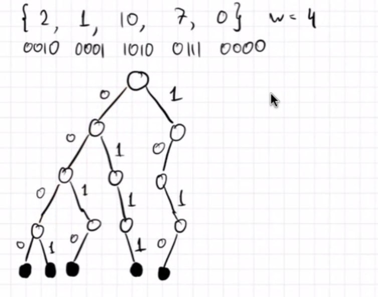

# Завершение темы деревьев

## Структуры данных для работы с числами

На этой лекции мы рассмотрим структуры данных, которые эффективно работают с числами в диапазоне до \\( 2^w \\), где w - это размер машинного слова (обычно 32 или 64 бита).

### Основные операции

Мы хотим, чтобы наша структура поддерживала следующие операции:

1. `add(x)` - добавление элемента x
2. `remove(x)` - удаление элемента x
3. `find(x)` - поиск элемента x
4. `next(x)` - нахождение минимального y, такого что y > x
5. `prev(x)` - нахождение максимального y, такого что y < x

Эти операции позволят нам эффективно манипулировать данными и выполнять различные алгоритмические задачи.

Мы научимся делать операции за O(w), а потом за O(log w)

### Битовый бор (trie)

Мы будем хранить числа хитрым образом, используя структуру данных, называемую битовым бором или префиксным деревом (trie).

#### Принцип работы битового бора:

1. **Представление чисел:** Каждое число представляется в двоичной форме (добиваем ведущими нулями до размера w)

2. **Структура дерева:** 
   - Корень дерева представляет пустую строку.
   - Каждый узел (кроме корня) соответствует одному биту (0 или 1).
   - Путь от корня до листа представляет число в двоичной форме.

3. **Хранение чисел:** 
   - Число хранится как путь от корня до листа.
   - Каждый уровень дерева соответствует позиции бита в числе.

4. **Преимущества:**
   - Эффективное использование памяти для чисел с общими префиксами.
   - Быстрый поиск, вставка и удаление (O(w), где w - длина числа в битах).

5. **Операции:**
   - `add(x)`: Добавляем путь для двоичного представления x.
   - `remove(x)`: Удаляем путь, соответствующий x.
   - `find(x)`: Проходим по пути, соответствующему x.
   - `next(x)` и `prev(x)`: Используем структуру дерева для эффективного поиска.

#### Пример:

В данном случае мы считали, что числа не совпадают, но никто не мешает нам в листах хранить число --- количество чисел приходящих в этот лист.

Время O(w), Память O(nw).

### Быстрый цифровой бор (x-fast trie)

X-fast trie - это усовершенствованная версия обычного битового бора, которая позволяет выполнять операции быстрее, за счет использования дополнительной памяти.

Как у нас работал next(x)?

1. Прочитать x (спуск) --- O(w)

2. Пойти направо (подъем + спуск в сына) ---  O(w)

3. Идти до конца влево (спуск) --- O(w)

Мы можем это ускорить:

#### Основные идеи:

1. **Хеширование префиксов:**
   - Для каждого уровня бора создаем хеш-таблицу.
   - В хеш-таблице хранятся все префиксы, существующие на данном уровне.

2. **Двоичный поиск по уровням:**
   - Вместо прохода сверху вниз, используем двоичный поиск по уровням бора. Благодаря хеш-таблицам из пункта 1. это происходит быстро.

3. **Связи между уровнями:**
   - Каждый узел хранит указатели на свой наименьший и наибольший лист-потомок.
   
Благодаря этому мы умеем делать вторую и третью операцию у next за O(1), а первую за O(log w).

#### Операции:

Теперь наши операции делают еще:

1. **find(x):** O(log w)
   - Используем двоичный поиск по уровням, чтобы найти наибольший существующий префикс x.

2. **next(x) и prev(x):** O(log w)
   - Находим наибольший существующий префикс x.
   - Используем указатели на листья для быстрого перехода к следующему/предыдущему элементу.

todo: описать функцию next_or_prev с лекции и в целом распиши поподробнее я не выкупил

3. **add(x) и remove(x):** O(w)
   - Обновляем все уровни и соответствующие хеш-таблицы.

#### Преимущества:

- Операции find, next и prev выполняются за O(log w) вместо O(w).
- Сохраняет преимущества обычного бора в представлении чисел.

#### Недостатки:

- Требует O(nw) памяти, что может быть значительно при больших n и w.
- Операции вставки и удаления остаются O(w).

### Сверхбыстрый цифровой бор (y-fast trie)

Y-fast trie - это дальнейшее улучшение x-fast trie, которое позволяет достичь лучшей производительности и эффективности использования памяти.

#### Основные идеи:

1. **Разделение на блоки:**
   - Разбиваем все числа на блоки размером O(log w).
   - Каждый блок представлен одним представителем

   

2. **Использование сбалансированных деревьев:**
   - Внутри каждого блока используем сбалансированное двоичное дерево поиска (например, красно-черное дерево).
   - Это позволяет эффективно управлять элементами внутри блока.

3. **Двухуровневая структура:**
   - Верхний уровень: x-fast trie для репрезентативных элементов блоков.
   - Нижний уровень: сбалансированные деревья для элементов внутри блоков.

#### Операции:

1. **find(x):** O(log w)
   - Используем x-fast trie для нахождения нужного блока.
   - Затем ищем элемент в сбалансированном дереве этого блока.

2. **next(x) и prev(x):** O(log w)
   - Находим блок, содержащий x или следующий за ним.
   - Используем сбалансированное дерево для точного поиска.

3. **add(x) и remove(x):** O(log w)
   - Находим нужный блок.
   - Обновляем сбалансированное дерево этого блока.
   - При необходимости обновляем структуру блоков (разделение или слияние).

#### Преимущества:

- Все основные операции выполняются за O(log w).
- Значительно меньшее использование памяти по сравнению с x-fast trie: O(n) вместо O(nw).
- Сохраняет эффективность для операций поиска и обновления.

#### Недостатки:

- Более сложная реализация по сравнению с x-fast trie.
- Необходимость поддержания баланса между блоками.

#### Сравнение с другими структурами:

| Структура | Операции | Память |
|-----------|----------|--------|
| Битовый бор | O(w) | O(nw) |
| X-fast trie | O(log w) для find/next/prev, O(w) для add/remove | O(nw) |
| Y-fast trie | O(log w) для всех операций | O(n) |

Y-fast trie предоставляет оптимальный баланс между скоростью операций и использованием памяти, делая его эффективным выбором для многих приложений, работающих с большими наборами целых чисел.
