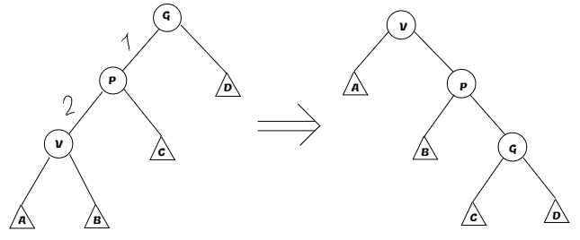
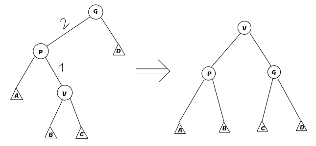

# Splay-tree
## Концепция
Предположим, что у нас есть бинарное дерево поиска, и мы знаем, что запросы в нем происходят неравномерно, то есть есть вершины, к которым мы почти не обращаемся, или наоборот, есть вершины, обращений к которым очень много, так вот, splay дерево такие запросы будет обрабатывать быстрее, чем за \( O(\log n) \), но даже если запросы максимально случайные, скорость упадет всего лишь до \( O(\log n) \). 
## Идея
В обычном [AVL-дереве](./Algorithms.pdf) запросы быстро обрабатываются, если ключи, к которым мы хотим получить доступ, лежат неглубоко, тогда давайте введем операцию **splay**, которая будет поднимать ключ в корень дерева. Тогда последующие операции с этим ключем будут работать быстрее, потому что перестраиваем дерево мы не сильно, а значит и опускается из корня вершина медленно. Так как других ограничений на дерево нет, то нам придется доказывать не реальное время работы, а [амортизированное](../semester_1/Algorithms1.pdf). 
## Операция splay
Сначала придумаем как реализовать основную операцию нашего дерева, поднимающую вершину в ее корень - **splay**. Вспомним про то, как мы поворачивали AVL-дерево, у нас было два типа поворотов - большие и маленькие, они нам позволяли балансировать правое и левое поддерево, теперь же нам надо проталкивать вершину в корень, заведем для этого 3 новых поворота, в чем нам поможет наш дядюшка Илон:

1. ***Zig*** - этот поворот мы будем использовать только в самом конце алгоритма, если вдруг, родитель вершины _x_ и есть корень. Вот его схема:
 
2.  ***Zigzig*** - этот поворот мы будем делать если у нашей вершины есть дедушка, и направление от дедушки к отцу и от отца к сыну одинаковые:
	
3. ***Zigzag*** - этот поворот мы делаем, если существует дедушка, и направление от него к отцу и отца к нашей вершине разные:

Заметим, что этих поворотов и условий для их использования достаточно, чтобы в любой ситуации однозначно понимать, какой из них надо использовать. Остается понять, почему амортизированно **splay** работает за \( O(\log n) \(.
### Доказательство скорости работы
В дальнейшем доказательстве я буду использовать такие обозначения:
\( x \) - вершина, с которой мы работаем,
\( T_x \) - размер поддерева вершины \( x \)
\(p\) - предок \(x\),
\(g\) - предок \(p\), 
\(w'(x)\) - вес после операции, 
\)w(x)\) - вес до операции.
Вспомним про то, как мы доказываем [амортизированную оценку](Амортизированная%20оценка), нужен какой-то потенциал. Заведем функцию веса вершины \(w(v) = \log(T_x)\), (на самом деле можно брать разные значения, что может помочь в доказательстве более лучших ограничений при специфичных обращениях к дереву). Тогда потенциалом \(\Phi_i\) будет сумма весов всех вершин в дереве после действия \(i\). Хорошо, попытаемся доказать такую верхнюю оценку на **splay(x)** - \(3(w'(x) - w(x)) + 1\).
#### Zig
Эту операцию мы ограничим сверху как \(w'(x) - w(x)+ 1\). За сколько операция работает? Очевидно за такое: $$\Phi_i - \Phi_{i-1} + 1 = w'(x) - w(x) + w'(p) - w(p) + 1$$ Заметим, что \(w'(p) - w(p) \leq 0\). Тогда заменим и получим искомое:$$w'(x) - w(x) + w'(p) - w(p) + 1\leq w'(x) - w(x) + 1$$
#### Zigzig
Тут уже посложнее, мы попробуем ограничить как \(3(w'(x) - w(x))\). Снова давайте преобразовывать: $$\Phi_i-\Phi_{i-1} + 2 = w'(x)+w'(p)+w'(g)-w(x)-w(p)-w(g)+2$$
Тут понадобятся нетривиальные замены, поймем, что так как _x_ стал корнем, а _g_ был корнем, то верно \(w'(x) = g(x)\), также так как _x_ потомок _p_, то верно \(w(x) < w(p)\), а после наоборот \(w'(p) < w'(x)\). Применим: $$w'(x)+w'(p)+w'(g)-w(x)-w(p)-w(g)+2 \leq w'(x)+w'(g)-2w(x) + 2$$ Мы хотим доказать, что она меньше \(3(w'(x) - w(x))\), то есть: $$w'(x)+w'(g)-2w(x) + 2\leq 3(w'(x) - w(x))\rightarrow w(x)+w'(g)-2w'(x)\leq -2$$
Хорошо, вспомним о том, как расскладывается формула веса вершины $$(w(x)-w'(x))+(w'(g)-w'(x))=(\log T_{x}-\log T_{x'})+(\log T_{g'} - \log T_{x'}) = \log \frac{T_{x}}{T_{x'}}+\log \frac{T_{g'}}{T_{x'}}$$Заметим, что \(T_x + T_{g'} = T_{x'} - 1\),  А это значит, что: $$\frac{T_x}{T_{x'}}+\frac{T_{g'}}{T_{x'}} < 1$$По теореме о средних мы можем сказать, что: $$\frac{T_x}{T_{x'}}*\frac{T_{g'}}{T_{x'}} < \frac{1}{4}$$Из чего уже следует искомое: $$\displaystyle\log\left({\frac{T_x}{T_{x'}}*\frac{T_{g'}}{T_{x'}} }\right) < -2$$
#### Zigzag
Все почти также, как в *zigzig*, сделаем все те же преобразования, что и там, за исключением \(w'(p) < w'(x)\), получим такое: $$w'(p)+w'(g)-2w(x) + 2$$Ограничим это сверху как \(2(w'(x)-w(x))\):$$w'(p)+w'(g)-2w(x) + 2\leq 2(w'(x)-w(x)) \rightarrow w'(p)+w'(g)-2w'(x)\leq -2$$Ну хорошо, а теперь снова посмотрим на структуру, полученную после поворота, и заметим, что \(T_{p'} + T_{g'} = T_{x'} - 1\), а значит, делая аналогичные преобразования, что мы делали в *zigzig*, мы получим искомое.
### Собираем вместе
Отлично, мы смогли найти ограничения на повороты, теперь нужно понять, какова граница времени работы всей операции **splay**. Огрубим оценку на **zigzag**, пусть он тоже работает за \(3(w'(x) - w(x))\). Если теперь просто посчитать сумму работы все операций, то у нас выйдет телескопическая сумма, все члены которой сократятся, кроме первого и последнего и 1, если был **zig**:$$w(x_{кон}) - w(x_{нач}) + 1$$Заметим, что в конце алгоритма _x_ - корень, а значит \(w(x_{кон})=\log n\). Получаем общую сложность работы \(O(\log n)\). Единственное, в чем **splay** дерево проигрывает **AVL**, это константа, потому что у **splay** она равна 3, а у **AVL** она равна 1, но обычно это нивелируется неравномерностью операций, так что зачастую **splay** дерево работает не хуже, а иногда даже лучше, чем **AVL**.
# Остальные операции
Все операции внутри вызывают **splay**, так что работают за его скорость.
## Split(x)
Чтобы сделать **split(x)**, просто спускаемся до _x_, если находим, то делаем от него **splay**, иначе делаем **splay** от вершины, в которую придем. После выполнения **splay** отрезаем от корня нужного ребенка и получаем два дерева.
## Merge(T1, T2)
Находим спуском наибольшую вершину правого дерева, делаем **splay** от нее, и привязываем к ней левое дерево.
## Add(x)
Делаем **split(x)**, полученные деревья становятся левым и правым поддеревом новой вершины с ключем *x*.
## Remove(l, r)
Просто делаем 2 сплита для того чтобы в отдельное дерево вынести все значения с _l_ по _r_, а далее смердживаем осавшиеся 2 куска.
## Find(x)
Просто спускаемся до нужно вершины и делаем **splay** от нее.